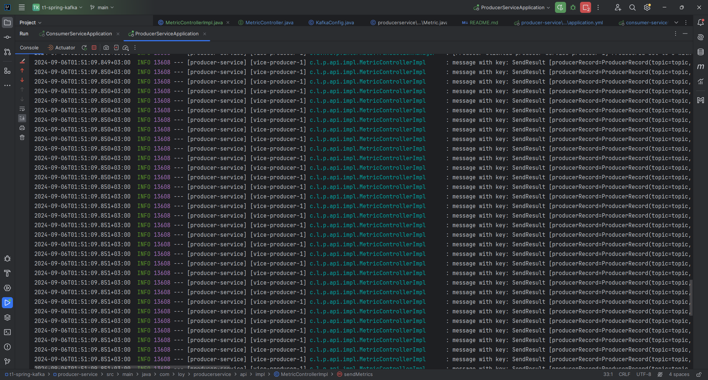

# T1 Spring Kafka

Данное приложение представляет собой демонстрацию полученных навыков по работе с Apache Kafka.

## Функционал

Приложение предоставляет возможность: Получать метрики стороннего микросервиса

Были созданы два микросервиса:

- consumer-service (port 8080)
- producer-service (port 8081)

и соответствующие API для демонстрации.

Документация по API доступна по следующим ссылкам: http://localhost:8080/swagger-ui.html        
http://localhost:8081/swagger-ui.html

Метрики выбирались с помощью Spring Actuator.

Чтобы отправить метрики нужно послать POST запрос на http://localhost:8081/metrics

Для хранения метрик в consumer-service использовался Redis

## Настройки Apache Kafka
### Producer
    - batch-size: 16384 (максимальный размер пакета для отправки batch) 
    - linger.ms: 1000 (интервал отправки для отправки batch в мс)
### Consumer
    -  value-deserializer: org.apache.kafka.common.serialization.ByteArrayDeserializer (десереализатор)

## Демо

Примеры использования приложения представлены на скриншотах:

### Логи после отправки сообщения в producer-service:


### Логи после отправки сообщения в consumer-service:


### Пример получения списка всех имен метрик:


### Пример получения значений по имени метрики:


## Запуск приложения

Для корректной работы приложения необходимо:

1. Установленный докер
2. Свободные порты: 8080, 8081, 9092, 2181, 6379

Чтобы запустить приложение, необходимо выполнить команду ```docker-compose up```, и далее запустить consumer-service 
и producer-service 